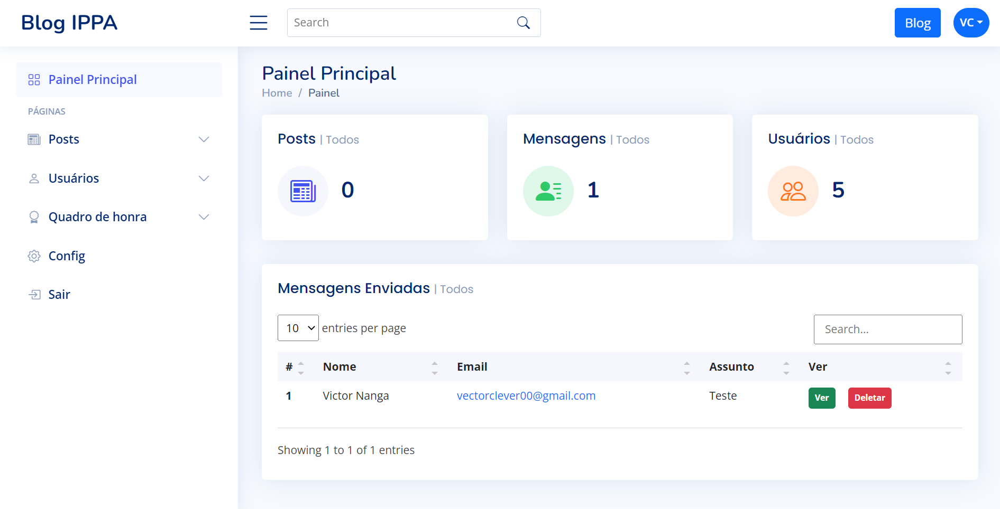

# app_blog

Um projecto para controlar e publicar as informações importantes que uma instituição pode acarretar
Criado e densenvolvido por Victor Clever

## Tecnologias

1. HTML
2. CSS
3. JS
4. PHP
5. GIT e GITHUB

##Contacto
clevervictor03@gmail.com -> email
@Victor03clever -> github
+244 938 295 867 -> telefone